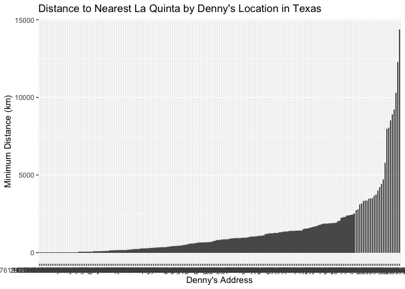
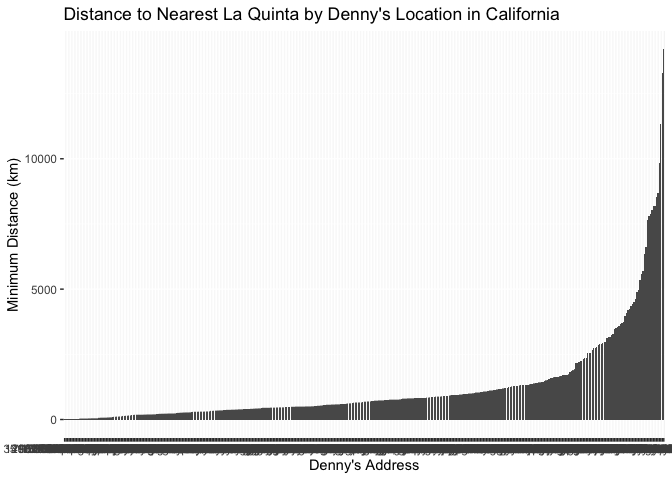

Lab 05 - La Quinta is Spanish for next to Denny’s, Pt. 2
================
Rachel Weiner
February 12, 2026

### Load packages and data

``` r
library(tidyverse) 
library(dsbox) 
```

``` r
states <- read_csv("data/states.csv")
```

``` r
data(dennys)
data(laquinta)
```

### Exercise 1

Back to the Denny’s and La Quinta data sets! First, I will start by
filtering the Dennys data set for only Alaska locations.

``` r
dn_ak <- dennys %>%
  filter(state == "AK")
nrow(dn_ak)
```

    ## [1] 3

There are three Denny’s locations in the state of Alaska. Now for the La
Quinta locations.

``` r
lq_ak <- laquinta %>%
  filter(state == "AK")
nrow(lq_ak)
```

    ## [1] 2

There are 2 total La Quinta locations in the state of Alaska.

### Exercise 2

Now we are interested in the distances between each Denny’s location
from each La Quinta location. To do so, we must calculate the distance
between six total pairings, for each of the three Dennys locations, I
will compare them to the two La Quinta locations to measure six total
distances.

### Exercise 3

To do so, we will begin by joining our data sets that we are more easily
able to compare distances through pairing.

``` r
dn_lq_ak <- full_join(dn_ak, lq_ak,
  by = "state")
```

    ## Warning in full_join(dn_ak, lq_ak, by = "state"): Detected an unexpected many-to-many relationship between `x` and `y`.
    ## ℹ Row 1 of `x` matches multiple rows in `y`.
    ## ℹ Row 1 of `y` matches multiple rows in `x`.
    ## ℹ If a many-to-many relationship is expected, set `relationship =
    ##   "many-to-many"` to silence this warning.

``` r
dn_lq_ak
```

    ## # A tibble: 6 × 11
    ##   address.x     city.x state zip.x longitude.x latitude.x address.y city.y zip.y
    ##   <chr>         <chr>  <chr> <chr>       <dbl>      <dbl> <chr>     <chr>  <chr>
    ## 1 2900 Denali   Ancho… AK    99503       -150.       61.2 3501 Min… "\nAn… 99503
    ## 2 2900 Denali   Ancho… AK    99503       -150.       61.2 4920 Dal… "\nFa… 99709
    ## 3 3850 Debarr … Ancho… AK    99508       -150.       61.2 3501 Min… "\nAn… 99503
    ## 4 3850 Debarr … Ancho… AK    99508       -150.       61.2 4920 Dal… "\nFa… 99709
    ## 5 1929 Airport… Fairb… AK    99701       -148.       64.8 3501 Min… "\nAn… 99503
    ## 6 1929 Airport… Fairb… AK    99701       -148.       64.8 4920 Dal… "\nFa… 99709
    ## # ℹ 2 more variables: longitude.y <dbl>, latitude.y <dbl>

Now we have a separate data frame with all six combinations of our two
organizations.

### Exercise 4

``` r
view(dn_lq_ak)
```

In this new data frame that we just created, there are six total
observations which each represent a pairing of a Denny’s locations and a
La Quinta location. The names in this data frame are similar to those of
the original data frames but are doubled to represent both the Dennys
location and the La Quinta location. Variables include address, city,
state, zip, longitude, and latitude. The Denny’s locations are marked
with .x after these variables while the La Quinta location variables end
with .y to seperate these two data frames.

### Exercise 5

``` r
haversine <- function(long1, lat1, long2, lat2, round = 3) {
  long1 <- long1 * pi / 180
  lat1 <- lat1 * pi / 180
  long2 <- long2 * pi / 180
  lat2 <- lat2 * pi / 180

  R <- 6371 

  a <- sin((lat2 - lat1) / 2)^2 + cos(lat1) * cos(lat2) * sin((long2 - long1) / 2)^2
  d <- R * 2 * asin(sqrt(a))

  return(round(d, round))
}
```

### Exercise 6

Now I will calculate each of the six distances to create a new distance
variable for each pairing.

``` r
dn_lq_ak <- dn_lq_ak %>%
  mutate(distance = mapply(haversine, 
                           longitude.x, latitude.x, 
                           longitude.y, latitude.y))
```

### Exercise 7

Now with this new variable, I will calculate the minimum distance
between a Denny’s and a La Quinta for each Denny’s location by creating
a new variable.

``` r
dn_lq_ak <- dn_lq_ak %>%
  group_by(address.x) %>%
  mutate(min_dist = min(distance, na.rm = TRUE)) %>%
  ungroup()
```

### Exercise 8

Let’s visualize this new variable of minimum distances.

``` r
summary(dn_lq_ak$min_dist)
```

    ##    Min. 1st Qu.  Median    Mean 3rd Qu.    Max. 
    ##   2.035   2.825   5.197   4.410   5.798   5.998

``` r
ggplot(dn_lq_ak, aes(x = reorder(address.x, min_dist), y = min_dist)) +
  geom_col() +
  labs(title = "Distance to Nearest La Quinta by Denny's Location in Alaska",
    x = "Denny's Address",
    y = "Minimum Distance (km)")
```

<!-- -->

The distribution of distances between the three Denny’s locations and
the closest La Quinta are displayed above. We can describe this
distribution as negatively skewed and unimodal. The least distance
between a Denny’s restauraunt and a La Quinta hotel is found at 2900
Denali in Anchorage Alaska with a distance of 2.035 km to the Anchorage
La Quinta location.

Now that we have a good idea of these distances in the consolidated
state of Alaska, let’s try North Carolina!

### Exercise 9

I am going to repeat exercises 1-9 for North Carolina.

``` r
dn_nc <- dennys %>%
  filter(state == "NC")
nrow(dn_nc)
```

    ## [1] 28

There are 28 total Denny’s locations in the state of North Carolina. Now
for the La Quinta locations.

``` r
lq_nc <- laquinta %>%
  filter(state == "NC")
nrow(lq_nc)
```

    ## [1] 12

There are 12 total La Quinta locations in the state of North Carolina.

``` r
dn_lq_nc <- full_join(dn_nc, lq_nc,
  by = "state")
```

    ## Warning in full_join(dn_nc, lq_nc, by = "state"): Detected an unexpected many-to-many relationship between `x` and `y`.
    ## ℹ Row 1 of `x` matches multiple rows in `y`.
    ## ℹ Row 1 of `y` matches multiple rows in `x`.
    ## ℹ If a many-to-many relationship is expected, set `relationship =
    ##   "many-to-many"` to silence this warning.

``` r
dn_lq_nc
```

    ## # A tibble: 336 × 11
    ##    address.x    city.x state zip.x longitude.x latitude.x address.y city.y zip.y
    ##    <chr>        <chr>  <chr> <chr>       <dbl>      <dbl> <chr>     <chr>  <chr>
    ##  1 1 Regent Pa… Ashev… NC    28806       -82.6       35.6 165 Hwy … "\nBo… 28607
    ##  2 1 Regent Pa… Ashev… NC    28806       -82.6       35.6 3127 Slo… "\nCh… 28208
    ##  3 1 Regent Pa… Ashev… NC    28806       -82.6       35.6 4900 Sou… "\nCh… 28217
    ##  4 1 Regent Pa… Ashev… NC    28806       -82.6       35.6 4414 Dur… "\nDu… 27707
    ##  5 1 Regent Pa… Ashev… NC    28806       -82.6       35.6 1910 Wes… "\nDu… 27713
    ##  6 1 Regent Pa… Ashev… NC    28806       -82.6       35.6 1201 Lan… "\nGr… 27407
    ##  7 1 Regent Pa… Ashev… NC    28806       -82.6       35.6 1607 Fai… "\nCo… 28613
    ##  8 1 Regent Pa… Ashev… NC    28806       -82.6       35.6 191 Cres… "\nCa… 27518
    ##  9 1 Regent Pa… Ashev… NC    28806       -82.6       35.6 2211 Sum… "\nRa… 27612
    ## 10 1 Regent Pa… Ashev… NC    28806       -82.6       35.6 1001 Aer… "\nMo… 27560
    ## # ℹ 326 more rows
    ## # ℹ 2 more variables: longitude.y <dbl>, latitude.y <dbl>

Now we have a separate data frame with all 336 combinations of Denny’s
and La Quinta North Carolina locations.

``` r
view(dn_lq_nc)
```

In this new data frame that we just created, there are 336 total
observations which each represent a pairing of a Denny’s locations and a
La Quinta location. The Denny’s locations are marked with .x after these
variables while the La Quinta location variables end with .y to separate
these two data frames.

Now to create the distance variable.

``` r
dn_lq_nc <- dn_lq_nc %>%
  mutate(distance = mapply(haversine, 
                           longitude.x, latitude.x, 
                           longitude.y, latitude.y))
```

Now with this new variable, I will calculate the minimum distance
between a Denny’s and a La Quinta for each Denny’s location by creating
a new variable, min_dist.

``` r
dn_lq_nc <- dn_lq_nc %>%
  group_by(address.x) %>%
  mutate(min_dist = min(distance, na.rm = TRUE)) %>%
  ungroup()
```

Let’s visualize this new variable of minimum distances in North
Carolina.

``` r
summary(dn_lq_nc$min_dist)
```

    ##    Min. 1st Qu.  Median    Mean 3rd Qu.    Max. 
    ##   1.779  22.388  53.456  65.444  93.985 187.935

``` r
ggplot(dn_lq_nc, aes(x = reorder(address.x, min_dist), y = min_dist)) +
  geom_col() +
  labs(title = "Distance to Nearest La Quinta by Denny's Location in North Carolina",
    x = "Denny's Address",
    y = "Minimum Distance (km)")
```

<!-- -->

As there are 28 total Denny’s locations in the state of North Carolina,
it makes sense that there are many more bars represented in this bar
plot. This makes it more difficult to read individual addresses but we
are able to get a very clear idea of the distribution across minimum
distances between locations.

This distribution follows a similar trend as the Alaska locations with a
minimum distance being 1.7 kms.

Now, let’s do this one more time for the state of Texas!

### Exercise 10

I am going to repeat exercises 1-9 for the state of Texas.

``` r
dn_tx <- dennys %>%
  filter(state == "TX")
nrow(dn_tx)
```

    ## [1] 200

There are 200 total Denny’s locations in the state of Texas. Now for the
La Quinta locations.

``` r
lq_tx <- laquinta %>%
  filter(state == "TX")
nrow(lq_tx)
```

    ## [1] 237

There are 237 total La Quinta locations in the state of Texas.

``` r
dn_lq_tx <- full_join(dn_tx, lq_tx,
  by = "state")
```

    ## Warning in full_join(dn_tx, lq_tx, by = "state"): Detected an unexpected many-to-many relationship between `x` and `y`.
    ## ℹ Row 1 of `x` matches multiple rows in `y`.
    ## ℹ Row 1 of `y` matches multiple rows in `x`.
    ## ℹ If a many-to-many relationship is expected, set `relationship =
    ##   "many-to-many"` to silence this warning.

``` r
dn_lq_tx
```

    ## # A tibble: 47,400 × 11
    ##    address.x    city.x state zip.x longitude.x latitude.x address.y city.y zip.y
    ##    <chr>        <chr>  <chr> <chr>       <dbl>      <dbl> <chr>     <chr>  <chr>
    ##  1 120 East I-… Abile… TX    79601       -99.6       32.4 3018 Cat… "\nAb… 79606
    ##  2 120 East I-… Abile… TX    79601       -99.6       32.4 3501 Wes… "\nAb… 79601
    ##  3 120 East I-… Abile… TX    79601       -99.6       32.4 14925 La… "\nAd… 75254
    ##  4 120 East I-… Abile… TX    79601       -99.6       32.4 909 East… "\nAl… 78516
    ##  5 120 East I-… Abile… TX    79601       -99.6       32.4 2400 Eas… "\nAl… 78332
    ##  6 120 East I-… Abile… TX    79601       -99.6       32.4 1220 Nor… "\nAl… 75013
    ##  7 120 East I-… Abile… TX    79601       -99.6       32.4 1165 Hwy… "\nAl… 76009
    ##  8 120 East I-… Abile… TX    79601       -99.6       32.4 880 Sout… "\nAl… 77511
    ##  9 120 East I-… Abile… TX    79601       -99.6       32.4 1708 Int… "\nAm… 79103
    ## 10 120 East I-… Abile… TX    79601       -99.6       32.4 9305 Eas… "\nAm… 79118
    ## # ℹ 47,390 more rows
    ## # ℹ 2 more variables: longitude.y <dbl>, latitude.y <dbl>

Now we have a separate data frame with all combinations of Denny’s and
La Quinta North Texas locations.

``` r
view(dn_lq_tx)
```

In this new data frame that we just created, there are 47,400 total
observations which each represent a pairing of a Denny’s locations and a
La Quinta location. This is a much larger number than both Alaska and
North Carolina due to the large number of Denny’s locations and La
Quinta locations. The Denny’s locations are marked with .x after these
variables while the La Quinta location variables end with .y to separate
these two data frames.

Now to create the distance variable.

``` r
dn_lq_tx <- dn_lq_tx %>%
  mutate(distance = mapply(haversine, 
                           longitude.x, latitude.x, 
                           longitude.y, latitude.y))
```

Now with this new variable, I will calculate the minimum distance
between a Denny’s and a La Quinta for each Denny’s location by creating
a new variable, min_dist.

``` r
dn_lq_tx <- dn_lq_tx %>%
  group_by(address.x) %>%
  mutate(min_dist = min(distance, na.rm = TRUE)) %>%
  ungroup()
```

Let’s visualize this new variable of minimum distances in Texas.

``` r
summary(dn_lq_tx$min_dist)
```

    ##    Min. 1st Qu.  Median    Mean 3rd Qu.    Max. 
    ##  0.0160  0.7305  3.3715  5.7918  6.6303 60.5820

``` r
ggplot(dn_lq_tx, aes(x = reorder(address.x, min_dist), y = min_dist)) +
  geom_col() +
  labs(title = "Distance to Nearest La Quinta by Denny's Location in Texas",
    x = "Denny's Address",
    y = "Minimum Distance (km)")
```

<!-- -->

Wow! Things sure are bigger in Texas! Now that we have a total of 200
Denny’s, we have a much larger set of x values for our x axis, making
this visualization quite difficult to read.

I lied, I am going to conduct this same analysis on one more state of my
choosing: California!

### Exercise 11

I am going to repeat exercises 1-9 for California.

``` r
dn_ca <- dennys %>%
  filter(state == "CA")
nrow(dn_ca)
```

    ## [1] 403

There are 28 total Denny’s locations in the state of North Carolina. Now
for the La Quinta locations.

``` r
lq_ca <- laquinta %>%
  filter(state == "CA")
nrow(lq_ca)
```

    ## [1] 56

There are 12 total La Quinta locations in the state of North Carolina.

``` r
dn_lq_ca <- full_join(dn_ca, lq_ca,
  by = "state")
```

    ## Warning in full_join(dn_ca, lq_ca, by = "state"): Detected an unexpected many-to-many relationship between `x` and `y`.
    ## ℹ Row 1 of `x` matches multiple rows in `y`.
    ## ℹ Row 1 of `y` matches multiple rows in `x`.
    ## ℹ If a many-to-many relationship is expected, set `relationship =
    ##   "many-to-many"` to silence this warning.

``` r
dn_lq_ca
```

    ## # A tibble: 22,568 × 11
    ##    address.x    city.x state zip.x longitude.x latitude.x address.y city.y zip.y
    ##    <chr>        <chr>  <chr> <chr>       <dbl>      <dbl> <chr>     <chr>  <chr>
    ##  1 14240 Us Hi… Adela… CA    92301       -117.       34.5 1752 Cle… "\nAn… 92802
    ##  2 14240 Us Hi… Adela… CA    92301       -117.       34.5 8858 Spe… "\nBa… 93308
    ##  3 14240 Us Hi… Adela… CA    92301       -117.       34.5 3232 Riv… "\nBa… 93308
    ##  4 14240 Us Hi… Adela… CA    92301       -117.       34.5 920 Univ… "\nBe… 94710
    ##  5 14240 Us Hi… Adela… CA    92301       -117.       34.5 3 Center… "\nLa… 90623
    ##  6 14240 Us Hi… Adela… CA    92301       -117.       34.5 1771 Res… "\nDa… 95618
    ##  7 14240 Us Hi… Adela… CA    92301       -117.       34.5 6275 Dub… "\nDu… 94568
    ##  8 14240 Us Hi… Adela… CA    92301       -117.       34.5 316 Pitt… "\nFa… 94534
    ##  9 14240 Us Hi… Adela… CA    92301       -117.       34.5 190 N. 1… "\nFo… 93625
    ## 10 14240 Us Hi… Adela… CA    92301       -117.       34.5 46200 La… "\nFr… 94538
    ## # ℹ 22,558 more rows
    ## # ℹ 2 more variables: longitude.y <dbl>, latitude.y <dbl>

Now we have a separate data frame with all 336 combinations of Denny’s
and La Quinta North Carolina locations.

``` r
view(dn_lq_ca)
```

In this new data frame that we just created, there are 336 total
observations which each represent a pairing of a Denny’s locations and a
La Quinta location. The Denny’s locations are marked with .x after these
variables while the La Quinta location variables end with .y to separate
these two data frames.

Now to create the distance variable.

``` r
dn_lq_ca <- dn_lq_ca %>%
  mutate(distance = mapply(haversine, 
                           longitude.x, latitude.x, 
                           longitude.y, latitude.y))
```

Now with this new variable, I will calculate the minimum distance
between a Denny’s and a La Quinta for each Denny’s location by creating
a new variable, min_dist.

``` r
dn_lq_ca <- dn_lq_ca %>%
  group_by(address.x) %>%
  mutate(min_dist = min(distance, na.rm = TRUE)) %>%
  ungroup()
```

Let’s visualize this new variable of minimum distances in North
Carolina.

``` r
summary(dn_lq_ca$min_dist)
```

    ##    Min. 1st Qu.  Median    Mean 3rd Qu.    Max. 
    ##   0.016   5.722  11.897  22.083  22.857 253.462

``` r
ggplot(dn_lq_ca, aes(x = reorder(address.x, min_dist), y = min_dist)) +
  geom_col() +
  labs(title = "Distance to Nearest La Quinta by Denny's Location in California",
    x = "Denny's Address",
    y = "Minimum Distance (km)")
```

<!-- -->

Similar to Texas, but even more so, this distribution is quite large and
very spread out. As there are over 400 Denny’s locations in California,
there are many bars within this bar plot.

### Exercise 12

Here, I will resumarize the summary statistics for each of the four
states analyzed, Alaska, North Carolina, Texas, and California.

``` r
summary(dn_lq_ak$min_dist)
```

    ##    Min. 1st Qu.  Median    Mean 3rd Qu.    Max. 
    ##   2.035   2.825   5.197   4.410   5.798   5.998

``` r
summary(dn_lq_nc$min_dist)
```

    ##    Min. 1st Qu.  Median    Mean 3rd Qu.    Max. 
    ##   1.779  22.388  53.456  65.444  93.985 187.935

``` r
summary(dn_lq_tx$min_dist)
```

    ##    Min. 1st Qu.  Median    Mean 3rd Qu.    Max. 
    ##  0.0160  0.7305  3.3715  5.7918  6.6303 60.5820

``` r
summary(dn_lq_ca$min_dist)
```

    ##    Min. 1st Qu.  Median    Mean 3rd Qu.    Max. 
    ##   0.016   5.722  11.897  22.083  22.857 253.462

According to the data output, Texas is clearly the most representative
of the Mitch Hedberg’s joke as they possess the lowest minimum distance
(0.016 km), the lowest 1st quartile (0.731 km) and the lowest median
(3.372 km). With these factors, and a mean only slightly greater than
that of Alaska’s, Texas is clearly the best state to showcase if you
would like to prove Mitch Hedberg’s joke true.

What a cool experiment?
